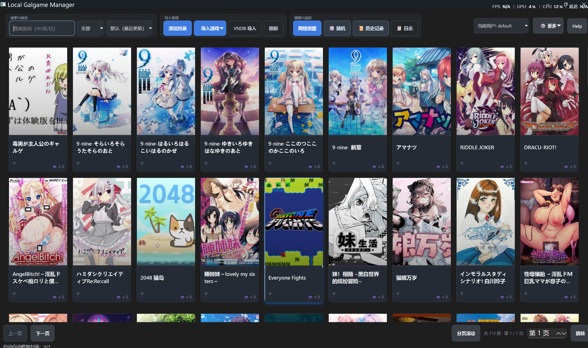

# Local Galgame Manager

**版本**: v2.0.5 | [下载](https://github.com/chunyangluo/Local-Galgame-Manager/releases/tag/v2.0.5)

<p align="center">
  
</p>

**补图**：将主窗口截图保存为 `docs/assets/main-window.png`（或把上面路径改成 `.gif`）并提交后，GitHub 与本地预览即可显示；仓库默认不带大图以减小体积。

---

## 核心亮点

1. **Windows 10/11** 本地 Galgame 库：多根目录扫描、识别启动 `exe`、大库下仍可浏览与搜索（网格分页 + 列表分批）。  
2. 元数据 **VNDB 为主、Bangumi 为辅**；封面在线缓存、重试与本地回退，策略支持仅本地 / 本地优先 / 网图优先。  
3. **手动改过的名称、启动路径、封面、存档路径不会被扫描或 VNDB 覆盖**；内置存档 ZIP 备份/还原、游玩记录、多用户与无 UI 命令行。

更细的操作说明见 **`docs/USER_GUIDE.md`**；插件开发见 **`docs/PLUGIN_GUIDE.md`**。

---

## 数据目录与覆盖规则（简）

| 项目 | 说明 |
|------|------|
| 数据根 | 一般为 `%LOCALAPPDATA%\LocalGalgameManager\data\`；无 `LOCALAPPDATA` 时回退到 `%USERPROFILE%\AppData\Local\LocalGalgameManager\data\`（逻辑见 `app/services/app_data_dir.py`） |
| 主要文件 | `manager.sqlite3`（库与设置）、`covers/`（封面缓存）、`save-backups/`（存档 ZIP）、`plugins/`（外部扫描插件）、`system_config.json` 等 |

**关键规则**：手动修改写入 **`custom_name` / `custom_launch_exe` / `custom_cover_path` / `custom_save_root`**，列表与启动时优先于扫描与自动识别；扫描与 VNDB **不会覆盖**这些字段。首次启动会尽量从旧版「当前工作目录」或 exe 旁 `data/` **补缺迁移**（不覆盖已有新数据）。

---

## 功能概览（与当前实现对齐）

### 扫描与元数据

- 多扫描根、管理对话框（添加/删除/清空）；清空全部根目录时的数据清理见 **`docs/USER_GUIDE.md`**
- 扫描后可 **VNDB 批量导入**（多线程）；未匹配 VNDB 的条目仍会入库
- **VNDB**：公开 API（无 token），内置限速与重试；**Bangumi**：在 VNDB 失败或无封面 URL 等场景作补充
- **封面**：下载失败会重试并按名称走 Bangumi；仍失败则尝试本地目录选图；支持菜单「重新获取封面」

### 界面

- **两行工具栏**：「找游戏」「库」；「账户」「显示」「系统」+ **「更多」**（备份、恢复、插件、Locale Emulator 等）
- 网格视图为 **自适应列 + 固定行分页** 浏览；列表视图为分批渲染，大库可保持可交互

### 存档管理（V2 当前）

- 入口：**游戏右键菜单「存档管理…」**、**游戏详情「存档管理…」**（独立窗口）
- 每个游戏可手动指定存档根目录（`custom_save_root`），支持一键打开目录；提供**自动发现**（内置规则 + 启发式扫描 + **可选 2DFan 线索库**）
- 一键备份当前存档为 ZIP 到数据目录：`save-backups/<user_id>/<game_id>/`
- 启动游戏前可开启**自动备份**（系统区开关：`启动前备份: ON/OFF`）
- 备份会写入 **SHA256**；还原前先校验，不通过则阻止还原
- 备份/还原使用后台任务，窗口内显示进度条与当前处理文件名
- 一键还原所选 ZIP；还原前会自动备份当前存档（防覆盖误操作）
- 备份列表支持：时间、名称、大小、重命名、删除
- **2DFan 线索（可选）**：与仓库内 **`tools/2dfan-save-crawler`** 共用 SQLite；主界面 **「更多」→「2DFan 线索库与爬虫…」** 或 **存档管理** 中配置全局路径后，「自动发现」可合并社区路径（仅当目录在本机存在；候选列表中带 `[2DFan]` 标记）

### 插件

- 扫描结果可经内置与外部插件变换后再入库；外部插件目录与数据根下 **`plugins/`** 一致  
- 说明与示例：**`docs/PLUGIN_GUIDE.md`**

### Locale Emulator（LE）转区

可选 **Windows 日文等环境启动**：本机安装 [Locale Emulator](https://github.com/xupefei/Locale-Emulator/releases) 后，在程序内 **「更多」→「Locale Emulator (LE)…」** 选择 **`LEProc.exe`** 并保存；留空即关闭 LE 路径。

| 使用入口 | 说明 |
|----------|------|
| 游戏列表右键 | **「LE 转区启动」**（未配置时不可用） |
| 游戏详情 | **「LE 转区启动」** 按钮 |
| 游玩历史 | 每条记录旁的 **「LE」** |

启动参数为 **`LEProc.exe` + 游戏 exe 绝对路径**；退出后仍会写游玩记录。与扫描插件的区别见 **`docs/PLUGIN_GUIDE.md`** 末尾。

---

## 技术栈

- Python 3.12+（开发与 CI/打包）
- PySide6（Qt6）、SQLite（`sqlite3`）
- PyInstaller（Windows 可执行文件）
- pytest + pytest-cov（测试与覆盖率）
- GitHub Actions（CI/CD）
- 其余依赖见 **`requirements.txt`**

### 架构设计

**主窗口拆分**：`MainWindow`（原 1500+ 行）拆分为 6 个职责清晰的 Mixin：

| Mixin | 职责 |
|-------|------|
| `scan_mixin.py` | 扫描目录管理、扫描执行/进度/取消 |
| `vndb_import_mixin.py` | VNDB/Bangumi 批量导入 |
| `cover_mixin.py` | 封面获取/重试/策略切换 |
| `launch_mixin.py` | 游戏启动/LE转区/启动后记录 |
| `game_action_mixin.py` | 右键菜单、收藏、编辑、分类、备份等 |
| `view_mixin.py` | 视图切换、筛选、渲染、空状态 |

### 测试覆盖

- **测试总数**：136 个单元测试
- **核心模块覆盖率**：
  - scanner: 93%
  - cover_manager: 82%
  - search_service: 100%
  - database: 68%

---

## 环境要求与从源码运行

```bash
pip install -r requirements.txt
python -m app.main
```

在项目根目录执行；数据写入上述 **LocalAppData** 下的 `data`，与 IDE、终端或打包 exe 启动方式无关。

---

## 命令行速查（无 UI）

| 用途 | 命令 |
|------|------|
| 扫描并打印 JSON | `python -m app.cli --root "D:\Games\Galgame" --json` |
| JSON 写入文件 | 同上，加 `--output scan_result.json` |
| 扫描并写入数据库 | `python -m app.cli --root "D:\Games\Galgame" --import-db` |
| VNDB 批量导入并入库 + 摘要 JSON | `python -m app.cli --root "D:\Games\Galgame" --vndb-import --threads 6 --import-db --json` |

完整参数与组合以 **`python -m app.cli --help`** 为准。

### 功能自检

```bash
python -m app.feature_selftest
```

可选联网与 UI 冒烟（并输出 JSON）：

```bash
python -m app.feature_selftest --with-network --with-ui --json
```

---

## Windows 打包

在项目根目录执行：

```powershell
./build.ps1
```

脚本会：尝试结束已运行的 `LocalGalgameManager` 进程；使用带时间戳的输出目录；安装依赖后调用 PyInstaller；仅在构建成功后更新桌面快捷方式 **`Local Galgame Manager.lnk`**。

**产物路径示例**：

```text
dist\builds\<yyyyMMdd-HHmmss>\LocalGalgameManager\LocalGalgameManager.exe
```

控制台会打印 `Build output: ...` 完整路径。

---

## 一键打包发布全流程

### 快速发布脚本

在项目根目录执行以下命令，**完整完成测试、打包、代码提交、发布**全流程：

```powershell
# ========== 1. 运行单元测试（确保代码质量） ==========
python -m pytest tests/ -q

# ========== 2. 功能自检（可选，验证核心功能） ==========
python -m app.feature_selftest

# ========== 3. 打包构建（生成 exe） ==========
./build.ps1

# ========== 4. 获取构建 ID 并创建发布包 ==========
$buildId = (Get-ChildItem -Path "dist\builds" -Directory | Sort-Object LastWriteTime -Descending | Select-Object -First 1).Name
Write-Host "Build ID: $buildId"
Compress-Archive -Path "dist\builds\$buildId\LocalGalgameManager" -DestinationPath "dist\builds\LocalGalgameManager-v2.0.5-win64.zip" -Force

# ========== 5. 更新版本文件（同步版本号） ==========
# 更新 CHANGELOG.md 中的版本说明
# 更新 README.md 中的版本号和下载链接

# ========== 6. 提交代码到 Git 仓库 ==========
git add -A
git status  # 确认要提交的文件
git commit -m "v2.0.5: 版本更新"
git push origin main  # 推送到远程仓库

# ========== 7. 推送版本标签（可选但推荐） ==========
git tag v2.0.5
git push origin v2.0.5

# ========== 8. 上传 GitHub Release ==========
gh release create v2.0.5 `
  --title "Local Galgame Manager v2.0.5" `
  --notes "**更新内容**：
- 修复扫描器路径误判 BUG
- 新增测试覆盖（136个测试）
- 接入 pytest-cov 覆盖率统计
- 配置 GitHub Actions CI
- MainWindow 架构拆分优化" `
  dist/builds/LocalGalgameManager-v2.0.5-win64.zip
```

### 分步说明

| 步骤 | 命令 | 说明 |
|------|------|------|
| 1 | `python -m pytest tests/ -q` | 运行单元测试（136个），确保代码质量 |
| 2 | `python -m app.feature_selftest` | 功能自检（可选），验证核心功能正常 |
| 3 | `./build.ps1` | 打包构建，自动更新桌面快捷方式 |
| 4 | `Compress-Archive ...` | 创建发布 ZIP 包 |
| 5 | 手动更新文件 | 更新 CHANGELOG.md 和 README.md 版本信息 |
| 6 | `git add -A && git commit && git push` | **提交并推送代码到 GitHub 仓库** |
| 7 | `git tag && git push origin <tag>` | 推送版本标签（可选） |
| 8 | `gh release create ...` | 创建 GitHub Release 并上传安装包 |

### 注意事项

1. **版本号**：脚本中的 `v2.0.5` 需要手动更新为当前版本号
2. **gh CLI**：需提前安装 [GitHub CLI](https://cli.github.com/) 并登录（`gh auth login`）
3. **CHANGELOG**：发布前建议更新 `CHANGELOG.md`
4. **README**：发布后建议更新 README 中的版本号和下载链接

### 环境要求

- Python 3.12+
- PyInstaller（会自动安装）
- GitHub CLI（用于发布）

---

## 开发收尾流程（建议）

改完代码后可在本地按顺序执行：**单元测试** → **（可选）自检** → **`./build.ps1`** → **提交推送**；打 zip、发 GitHub Release 与 `gh` 凭据等细节见 **`docs/RELEASE_CHECKLIST.md`**。

---

## 仓库与文档索引

| 路径 | 内容 |
|------|------|
| `docs/USER_GUIDE.md` | 用户操作、扫描、VNDB、备份等 |
| `docs/PLUGIN_GUIDE.md` | 插件接口与放置位置 |
| `docs/DB_DESIGN.md` | 数据库设计说明 |
| `docs/RELEASE_CHECKLIST.md` | 发布检查清单 |
| `CHANGELOG.md` | 版本变更记录 |

---

## 开源协作（分支约定）

- `main`：发布分支  
- `dev`：集成开发  
- `feature/*`：功能分支  
- `hotfix/*`：线上修复  

具体以仓库实际策略为准。

---

## FAQ

**Q：改完界面代码要重启吗？**  
A：要。Python/PySide6 在进程启动时加载模块，保存 `.py` 后需**退出程序再运行**（或重新启动调试会话）才能看到界面逻辑变更；点「刷新」只会重载数据库列表，不会热替换代码。

**Q：打包报 `PermissionError` 或文件被占用？**  
A：先退出正在运行的 **`LocalGalgameManager.exe`**（及托盘进程），再执行 `build.ps1`；脚本也会尝试结束同名进程。

**Q：数据存在哪？换电脑怎么带？**  
A：默认在 **`%LOCALAPPDATA%\LocalGalgameManager\data\`**。可用程序内 **「更多」→ 导出备份 / 恢复备份**（zip），或自行复制该目录（注意关闭程序后再拷）。

**Q：VNDB 封面一直「等待缓存」或失败？**  
A：在线封面由后台任务下载到 `covers/`，不在 UI 线程拉网图。可右键 **「重新获取封面」**；仍失败请检查网络、防火墙与 **`docs/USER_GUIDE.md`** 中的封面策略说明。

**Q：扫描后条数变少？**  
A：未匹配 VNDB 的条目仍会入库；若根目录被清空或删除，会按设计清理关联数据，详见 **USER_GUIDE**。

**Q：从源码运行与 exe 数据是否共用？**  
A：共用同一套 **LocalAppData** 数据目录（除非自行改代码中的数据路径逻辑）。

**Q：存档管理里的备份 ZIP 放在哪里？**  
A：默认在 **`%LOCALAPPDATA%\LocalGalgameManager\data\save-backups\<user_id>\<game_id>\`**。删除列表记录时会同时尝试删除对应 ZIP 文件。

**Q：还原存档会不会把当前进度覆盖掉？**  
A：会覆盖目标存档目录内容，但程序会在还原前自动再打包一份“还原前自动备份”，可用于回退。

**Q：自动发现存档路径是怎么找的？**  
A：优先按内置规则匹配常见目录（如 `save` / `SaveData` / `www/save`），再在游戏目录做限深启发式扫描；最终给出候选列表，由你确认后保存到 `custom_save_root`。

**Q：备份校验失败为什么不让还原？**  
A：当前策略是“安全优先”：若 SHA256 与记录不一致，会直接阻止还原，避免把损坏或被篡改的压缩包覆盖到当前存档。

---

## 许可证

见仓库根目录 **`LICENSE`**。
